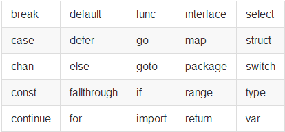
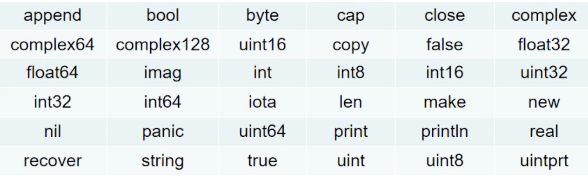
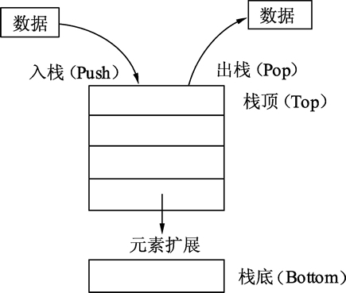
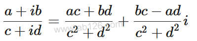
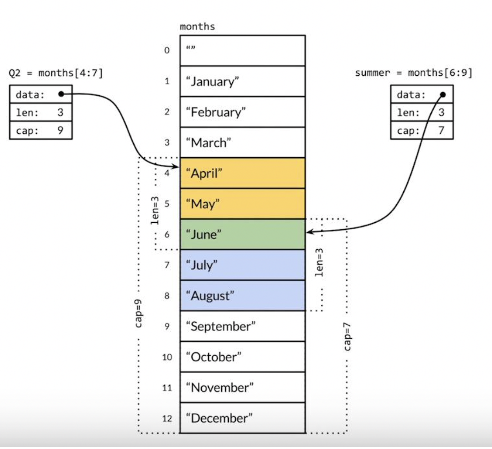
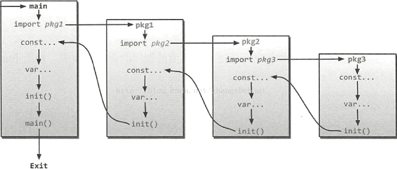

# Go

[TOC]

## 环境搭建

### 包管理代理地址无法访问

proxy.golang.org 无法访问，使用环境变量`GOPROXY`设置包管理网站代理：

```shell
go env -w GOPROXY=https://goproxy.cn
```

### 执行单个go源码文件

**编译运行：**

1. 编写golang源代码
2. 使用`go build 源码` 对go源码进行编译，生成可执行文件
3. 执行可执行文件

**直接运行源码：**

1. `go run 源码`
2. 类似脚本的形式，将编译与运行整合在了一起

### go的环境变量

```shell
$ go env //打印Go所有默认环境变量
$ go env GOPATH //打印某个环境变量的值
```

```shell
$ go env
GO111MODULE=""
GOARCH="amd64"
# 【开发程序编译后二进制命令的安装目录】，默认为 $GOPATH/bin
GOBIN=""
GOCACHE="/Users/yangsx/Library/Caches/go-build"
GOENV="/Users/yangsx/Library/Application Support/go/env"
GOEXE=""
GOFLAGS=""
GOHOSTARCH="amd64"
GOHOSTOS="darwin"
GOINSECURE=""
GOMODCACHE="/Users/yangsx/go/pkg/mod"
GONOPROXY=""
GONOSUMDB=""
GOOS="darwin"
# 【工作区】，用于存放开发源代码、测试文件、静态库文件等
# $GOPATH/src 源码路径，也是工程包的查找根路径，感觉这是一个糟糕的设计，切换项目还要更改GOPATH变量
# $GOPATH/bin 生成的可执行文件路径
# $GOPATH/pkg 编译后的静态库文件
GOPATH="/Users/yangsx/go"
GOPRIVATE=""
GOPROXY="https://goproxy.cn"
GOROOT="/usr/local/go"
GOSUMDB="sum.golang.org"
GOTMPDIR=""
GOTOOLDIR="/usr/local/go/pkg/tool/darwin_amd64"
GOVCS=""
GOVERSION="go1.16.6"
GCCGO="gccgo"
AR="ar"
CC="clang"
CXX="clang++"
CGO_ENABLED="1"
GOMOD="/dev/null"
CGO_CFLAGS="-g -O2"
CGO_CPPFLAGS=""
CGO_CXXFLAGS="-g -O2"
CGO_FFLAGS="-g -O2"
CGO_LDFLAGS="-g -O2"
PKG_CONFIG="pkg-config"
GOGCCFLAGS="-fPIC -arch x86_64 -m64 -pthread -fno-caret-diagnostics -Qunused-arguments -fmessage-length=0 -fdebug-prefix-map=/var/folders/gt/jsx__87n0m71ld6z5ddrvm7h0000gn/T/go-build3446516207=/tmp/go-build -gno-record-gcc-switches -fno-common"
```

#### GOROOT

go语言的安装路径，在`Windows`中，`GOROOT`的默认值是`C:/go`，而在`Mac OS`或`Linux`中`GOROOT`的默认值是`usr/loca/go`，如果将Go安装在其他目录中，而需要将GOROOT的值修改为对应的目录。

安装路径下的目录结构如下：

```shell
$ tree -L 2  . 
. 
├── AUTHORS # 参与开发的作者
├── CONTRIBUTING.md # 贡献指南
├── CONTRIBUTORS # 捐赠人
├── LICENSE # 开源协议
├── PATENTS # 专利
├── README.md
├── SECURITY.md # 安全
├── VERSION # 当前版本
├── api
│   ├── README
│   ├── except.txt
│   ├── go1.1.txt
│   ├── ...
│   ├── go1.9.txt
│   ├── go1.txt
│   └── next.txt
├── bin # go的工具链
│   ├── go
│   └── gofmt
├── doc # go的文档
│   ├── asm.html
│   ├── go1.16.html
│   ├── go_mem.html
│   └── go_spec.html
├── favicon.ico
├── lib
│   └── time
├── misc
│   ├── android
│   ├── arm
│   ├── cgo
│   ├── chrome
│   ├── ...
│   └── wasm
├── pkg
│   ├── darwin_amd64
│   ├── darwin_amd64_race
│   ├── include
│   └── tool
├── robots.txt
├── src # 内置包的源码文件
│   ├── Make.dist
│   ├── README.vendor
│   ├── ...
│   └── vendor
└── test # 测试源码
    ├── 235.go
    ├── 64bit.go
    ├── README.md
    ├── ...
    └── zerodivide.go
```

#### GOPATH

是GO的工作空间，路径不能与`GOROOT`相同，用于指定我们的开发工作区(workspace),是存放源代码、测试文件、库静态文件、可执行文件的工作。默认路径如下：

- Windows：`%USERPROFILE%\go`
- *nix：`$home/go`

按照go的开发规范，`GOPATH`下一般分为三个子目录：

- `src`，源代码
- `pkg`，编译后的静态库文件
- `bin`，源代码编译后的可执行文件

#### 交叉编译：GOOS和GOARCH

交叉编译是指：在一个平台上就能生成可以在另一个平台运行的代码，例如，我们可以32位的Windows操作系统开发环境上，生成可以在64位Linux操作系统上运行的二进制程序。

在其他编程语言中进行交叉编译可能要借助第三方工具，但在Go语言进行交叉编译非常简单，最简单只需要设置`GOOS`和`GOARCH`这两个环境变量就可以了。

`GOOS`和`GOARCH`这两个变量总是成对出现，只能是下面的值：

```
// GOOS的默认值为当前的操作系统，macos的值为drawin
// GOARCH代表CPU架构
$GOOS	    $GOARCH
android	    arm
darwin	    386
darwin	    amd64
darwin	    arm
darwin	    arm64
dragonfly   amd64
freebsd	    386
freebsd	    amd64
freebsd	    arm
linux	    386
linux	    amd64
linux	    arm
linux	    arm64
linux	    ppc64
linux	    ppc64le
linux	    mips
linux	    mipsle
linux	    mips64
linux	    mips64le
linux	    s390x
netbsd	    386
netbsd	    amd64
netbsd	    arm
openbsd	    386
openbsd	    amd64
openbsd	    arm
plan9	    386
plan9	    amd64
solaris	    amd64
windows	    386
windows	    amd64
```


## 关键字与标识符

### 标识符命名访问规则

1. 由数字、字母、下划线组成

2. 不可以以数字开头、不能含有空格、区分大小写、不可以使用保留关键字

3. 见名知意

4. 下划线 `_`在go中是一个特殊的标志符，可以代表其他任何标志符，但是他对应的值将会被忽略，所以仅仅用作占位符

   注意，下划线变量不可以被使用

5. int也不是保留关键字，但是不建议使用 `var int int = 100`

6. 标识符的长度没有限制，但是不建议过长

---

**包：**

1. 包名与文件夹名称尽量相同
2. 程序入口也就是main方法，需要放到main包下，如果不放，不会得到可执行文件
3. 包的名称不要和标准库冲突，比如fmt
4. 导入包，包是由 `$GOPATH/src/`路径下计算的，所层级使用`/`分割

---

**变量、常量、函数：**

1. 尽量使用驼峰命名法
2. 如果首字母是大写，可以被其他包访问，如果首字母小写，则说明是私有的

### 关键字

关键字是程序发明者规定的含有特殊含义的单词，又叫保留字，go语言一共25个关键字



### 预定义标识符

含基础数据类型以及系统内嵌函数在内一共36个预定义标识符，尽量不要使用：



## 变量和常量

### 声明、赋值变量

```go
var name type

// 一次声明多个同一类型的变量
var a, b int

// 批量声明变量
var (
    a int
    b string
    c []float32
    d func() bool
    e struct {
        x int
    }
)

// 声明变量并赋值
var a int = 10 

// 声明变量但是没有初始化的，将会赋予指定数据类型
var b int // b = 0

// 变量类型自动推断
var age = 100 // 自动推断为int
fmt.Println("type=", reflect.TypeOf(age))

// := 简短声明
age := 10 // 自动推断类型为int

// 多变量赋值，a b 变量交换
var a int = 100
var b int = 200
b, a = a, b
fmt.Println(a, b)
```

### 匿名变量_

匿名变量的特点是一个下画线“_”，“_”本身就是一个特殊的标识符，被称为空白标识符。它可以像其他标识符那样用于变量的声明或赋值（任何类型都可以赋值给它），但任何赋给这个标识符的值都将被抛弃，因此这些值不能在后续的代码中使用，也不可以使用这个标识符作为变量对其它变量进行赋值或运算。使用匿名变量时，只需要在变量声明的地方使用下画线替换即可。例如：

```go
func GetData() (int, int) {
    return 100, 200
}
func main(){
    a, _ := GetData()
    _, b := GetData()
    fmt.Println(a, b)
}
```

### 堆和栈空间

栈：线性表，后进先出，适合可预知大小的变量分配



堆：类似于往一个房间里摆放各种家具，家具的尺寸有大有小，分配内存时，需要找一块足够装下家具的空间再摆放家具。堆适合不可预知大小的内存分配，但是速度相对较慢，并且容易出现内存碎片


```go
func calc(a, b int) int {
    var c int // 在栈中分配一个指定大小的内存
    c = a * b
    var x int // 在栈中分配一个指定大小的内存
    x = c * 10 
    return x
}

```

### 变量存储在堆还是栈？

Go语言在编译期会帮助开发者判断变量应该放到堆上还是栈上（C++需要开发者自行判断），他的判断规则为：

- 在编译期间堆变量进行**逃逸分析**
  - 没有发生：栈
  - 发生了：堆

#### 变量逃逸分析

```go
package main
import "fmt"
// 本函数测试入口参数和返回值情况
func dummy(b int) int {
    // 声明一个变量c并赋值
    var c int
    c = b
    return c
}
// 空函数, 什么也不做
func void() {
}
func main() {
    // 声明a变量并打印
    var a int
    // 调用void()函数
    void()
    // 打印a变量的值和dummy()函数返回
    fmt.Println(a, dummy(0))
}
```

使用如下命令对上面代码进行内存分析：

```shell
# -m 内存分配分析
# -l 避免程序内联，也就是避免程序进行优化
go run -gcflags "-m -l" main.go

# command-line-arguments
./main.go:19:13: ... argument does not escape
./main.go:19:13: a escapes to heap # 变量a逃逸到了堆
./main.go:19:22: dummy(0) escapes to heap # dumy(0)的返回值逃逸到了堆
```

#### 变量逃逸分析：取地址符

```go
package main
import "fmt"
// 声明空结构体测试结构体逃逸情况
type Data struct {
}
func dummy() *Data {
	// 实例化c为Data类型
	var c Data
	//返回函数局部变量地址
	return &c
}
func main() {
	fmt.Println(dummy())
}
```

执行`go run -gcflags "-m -l" main.go`的结果：

```shell
# command-line-arguments
./main.go:8:6: moved to heap: c # 变量c在第八行的位置，因为使用&取地址符，为了保证程序的最终运行结果，所以将变量c从栈转移到了堆空间中
./main.go:13:13: ... argument does not escape
&{}
```

### 变量的作用域和生命周期

| 变量类型 | 定义位置     | 生命周期                                     |
| -------- | ------------ | -------------------------------------------- |
| 全局变量 | 函数外部定义 | 等同于整个程序的运行周期                     |
| 局部变量 | 函数内定义   | 创建变量的语句开始，到这个变量不再被使用为止 |
| 形参     | 函数签名定义 | 函数被调用的时候创建，函数调用结束后被销毁   |

> 变量逃逸会导致变量作用域的改变

### 常量

- 用于存储不会发生改变的数据
- 在编译时被创建，即使是函数内部的常量
- 常量值只能是布尔型、数字型、字符串型
- 定义常量的表达式必须是编译器可以进行求值的常量表达式

#### 显示类型定义

```go
const pi float64 = 3.14159
```

#### 隐式类型定义：将会由值推断类型

```go
const pi = 3.14159
```

#### 值必须是编译期间就可以确定的

```go
const c1 = 2/3
const c2 = getNumber() // 引发构建错误: getNumber() 用做值
```

#### 批量声明常量

```go
const (
    e  = 2.7182818
    pi = 3.1415926
)
```

#### 模拟枚举：iota常量生成器

```go
package main
import "fmt"
// 声明芯片类型(类型别名)
type ChipType int

const (
    None ChipType = iota
    CPU    // 中央处理器
    GPU    // 图形处理器
)

// 定义 ChipType 类型的方法 String()，返回值为字符串类型
// String() 是类型进行字符串输出时调用的方法
func (c ChipType) String() string {
    switch c {
    case None:
        return "None"
    case CPU:
        return "CPU"
    case GPU:
        return "GPU"
    }
    return "N/A"
}

func main() {
    // 输出CPU的值并以整型格式显示
    fmt.Printf("%s %d", CPU, CPU)
}
// 在一个 const 声明语句中，在第一个声明的常量所在的行，iota 将会被置为 0，然后在每一个有常量声明的行加一。
```

## 数据类型

### 值类型和引用类型

#### 值类型

这些类型的变量直接指向存在内存中的值，**值类型的变量的值存储在栈中**。当使用等号`=`将一个变量的值赋给另一个变量时，如` j = i `,实际上是在内存中将 `i` 的值进行了拷贝。可以通过 `&i `获取变量 `i` 的内存地址。

在golang中，是值类型的有：

- 数字类型
- 布尔类型
- 字符串类型
- 数组：数组也存放在栈空间中，这个与Java不同
- 结构体：因为是值传递，所以在方法之间传递会进行值复制，如果结构体较大，需要使用指针

#### 引用类型

引用类型拥有更复杂的存储结构:

1. 通过make创建并分配内存 
2. 初始化一系列属性：指针、长度、哈希分布、数据队列等。一个引用类型的变量`r1`存储的是`r1`的值所在的内存地址（数字），或内存地址中第一个元素所在的位置，这个内存地址被称之为指针，这个指针实际上也被存在另外的某一个变量中。

在go语言中，是引用类型的有：

- 指针
- 管道 channel
- 接口 interface
- map
- 函数 function

#### 值类型与引用类型区别

**值类型在传递参数时，进行值拷贝，引用类型则是引用拷贝。**主要是赋值的区别。

#### 类型零值

零值又称为默认值，在go中，每种类型都有对应的零值，其中引用类型的零值都为`nil`：

| 数据类型                                                     | 零值                       |
| ------------------------------------------------------------ | -------------------------- |
| 数字类型，包含整型、浮点型、复数                             | 0                          |
| 布尔型                                                       | false                      |
| 字符串                                                       | ""                         |
| 结构体                                                       | 结构体中的每个字段都是零值 |
| 引用类型：`slice`， `pointer`，`map`，`channel`，`function`，`interface` | `nil`                      |

#### nil详

在Go语言中，布尔类型的零值（初始值）为 false，数值类型的零值为 0，字符串类型的零值为空字符串`""`，而指针、切片、映射、通道、函数和接口的零值则是 `nil`。

> 注意，nil是一个值，像0一样，代表不存在

##### 不是关键字和保留字

因为不是关键字和保留字，只是一个标识符，类似int等，所以可以定义一个名称为`nil`的变量：

```go
var nil = errors.New("my god") 
```

##### 没有默认类型

```go
package main
import (
    "fmt"
)
func main() {
    fmt.Printf("%T", nil) // .\main.go:9:10: use of untyped nil
    print(nil)
}
```

##### 引用类型的零值(初始值)就是nil

```go
package main

import (
    "fmt"
)

func main() {
    var m map[int]string
    var ptr *int
    var c chan int
    var sl []int
    var f func()
    var i interface{}
    fmt.Printf("%#v\n", m) // map[int]string(nil)
    fmt.Printf("%#v\n", ptr) // (*int)(nil)
    fmt.Printf("%#v\n", c) // (chan int)(nil)
    fmt.Printf("%#v\n", sl) // []int(nil)
    fmt.Printf("%#v\n", f) // (func())(nil)
    fmt.Printf("%#v\n", i) // <nil>
}
```

##### 不同引用类型的nil值，指针是相同的

```go
package main
import (
    "fmt"
)
func main() {
    var arr []int
    var num *int
    fmt.Printf("%p\n", arr) // 0x0
    fmt.Printf("%p", num) // 0x0
}
```

##### 不同引用类型的nil值，占用大小不同

```go
package main
import (
    "fmt"
    "unsafe"
)
func main() {
    var p *struct{}
    fmt.Println( unsafe.Sizeof( p ) ) // 8
    var s []int
    fmt.Println( unsafe.Sizeof( s ) ) // 24
    var m map[int]bool
    fmt.Println( unsafe.Sizeof( m ) ) // 8
    var c chan string
    fmt.Println( unsafe.Sizeof( c ) ) // 8
    var f func()
    fmt.Println( unsafe.Sizeof( f ) ) // 8
    var i interface{}
    fmt.Println( unsafe.Sizeof( i ) ) // 16
}
```

##### nil值的比较

直接比较字面量nil，可以比较：

```go
package main
import (
    "fmt"
)
func main() {
    fmt.Println(nil==nil)  // 报错
}
```

两个值都为nil的不同类型变量不可比较：

```go
package main
import (
    "fmt"
)
func main() {
    var m map[int]string
    var ptr *int
    fmt.Printf(m == ptr) // invalid operation: arr == ptr (mismatched types []int and *int)
}
```

两个值为nil的相同类型变量也不可比较：

```go
package main
import (
    "fmt"
)
func main() {
    var s1 []int
    var s2 []int
    fmt.Printf(s1 == s2) // invalid operation: s1 == s2 (slice can only be compared to nil)
}
```

变量(有可能是nil 或者 非nil)可以与nil值比较：

```go
package main
import (
    "fmt"
)
func main() {
    var s1 []int
    fmt.Println(s1 == nil) // true
}
```

### 基本数据类型

#### 数值型

##### 整型

###### 无符号整型

| 数据类型 | 存储空间(字节)       | 值范围                               | 数据级别     | 默认值 |
| -------- | -------------------- | ------------------------------------ | ------------ | ------ |
| `uint8`  | 1                    | 0 ~ 255                              | 百           | 0      |
| `uint16` | 2                    | 0 ~65535                             | 6万多        | 0      |
| `uint32` | 3                    | 0 ~ 4294967295                       | 40多亿       | 0      |
| `uint64` | 4                    | 0 ~ 18446744073709551615             | 大到没有概念 | 0      |
| `uint`   | 系统决定，无符号整型 | 32位系统位`int32`，64位系统位`int64` |              | 0      |

```go
var ui2 uint8 = 1
fmt.Printf("类型 uint8, 长度=%d字节 \n", unsafe.Sizeof(ui2))
var ui3 uint16 = 1
fmt.Printf("类型 uint16, 长度=%d字节 \n", unsafe.Sizeof(ui3))
var ui4 uint32 = 1
fmt.Printf("类型 uint32, 长度=%d字节 \n", unsafe.Sizeof(ui4))
var ui5 uint64 = 1
fmt.Printf("类型 uint64, 长度=%d字节 \n", unsafe.Sizeof(ui5))
```


###### 有符号整型

| 数据类型 | 存储空间(字节)       | 值范围                                     | 数据级别         | 默认值 |
| -------- | -------------------- | ------------------------------------------ | ---------------- | ------ |
| `int8`   | 1                    | -128 ~ 127                                 | 正负百           | 0      |
| `int16`  | 2                    | -32768 ~ 32767                             | 正负3万多        | 0      |
| `int32`  | 3                    | -2147483648 ~ 2147483647                   | 正负大20多亿     | 0      |
| `int64`  | 4                    | -9223372036854775808 ~ 9223372036854775807 | 正负大到没有概念 | 0      |
| `int`    | 系统决定，有符号整型 | 32位系统位`int32`，64位系统位`int64`       |                  | 0      |

```go
var i2 int8 = 1
fmt.Printf("类型 int8, 长度=%d字节 \n", unsafe.Sizeof(i2))
var i3 int16 = 1
fmt.Printf("类型 int16, 长度=%d字节 \n", unsafe.Sizeof(i3))
var i4 int32 = 1
fmt.Printf("类型 int32, 长度=%d字节 \n", unsafe.Sizeof(i4))
var i5 int64 = 1
fmt.Printf("类型 int64, 长度=%d字节 \n", unsafe.Sizeof(i5))
```


###### 字符整型

| 数据类型 | 存储空间(字节) | 作用                      |
| -------- | -------------- | ------------------------- |
| `byte`   | `uint8`的别名  | 用与表示一个ASCII         |
| `rune`   | `int32`的别名  | 用于表示一个Unicode代码点 |

```go
// 获取对应字符的ASCII码值
var a byte = 'a'
fmt.Println(a)

// 将字符串转换为Unicode码点
first := "Hello, 世界"
fmt.Println([]rune(first))
```

**表示一个ASCII：**

```go
var ch byte = 65
var ch byte = '\x41' // 16进制
var ch byte = 'A'
```

**表示一个Unicode代码点：**

```go
var ch byte ='\u0041' // ASCII码值 六十进制41 十进制65 对应大写字母A
fmt.Printf("%c", ch) // ASCII对应单个字节，故可以使用byte类型接收

var ch2 rune = '\u266b' // 对应ASCII字符 🎵
fmt.Printf("%c", ch2) // 占用四个字节，故使用rune接收

var ch3 int64 = '\U0001F4B8' // 部分ASCII码值（比如生僻汉字），会占用四个字节以上，💸
fmt.Printf("%c", ch3)  // 所以使用`\U`大写U字母来表示一个Unicode字符，占用8个字节，不够前面补0
```


##### 浮点型

| 数据类型            | 存储空间(字节) | 值范围                                                       | 数据级别     | 默认值 |
| ------------------- | -------------- | ------------------------------------------------------------ | ------------ | ------ |
| `float32`（不常用） | 3              | IEEE-754 1.401298464324817070923729583289916131280e-45 ~ 3.402823466385288598117041834516925440e+38 | 精度6位小数  | 0      |
| `float64`           | 4              | IEEE-754 4.940656458412465441765687928682213723651e-324 ~ 1.797693134862315708145274237317043567981e+308 | 精度15位小数 | 0      |

```go
fmt.Println("---------------- 浮点型 ------------------")
f0 := 3.14
fmt.Printf("类型推断： %T \n", f0)
var f1 float32 = 1
fmt.Printf("类型 float32, 长度=%d字节 \n", unsafe.Sizeof(f1))
var f2 float64 = 1
fmt.Printf("类型 float64, 长度=%d字节 \n", unsafe.Sizeof(f2))
// float32可能会有精度丢失，所以通常使用float64
var f3 float32 = 314e-2 // 314 / 10^2
fmt.Printf("指数方式表示: %f \n", f3)
var f4 float32 = 0.0314e2 // 0.0314 * 10^2
fmt.Printf("指数方式表示: %f \n", f4)
```

##### 复数

> 我们把形如 z=a+bi（a、b均为实数）的数称为复数。其中，a 称为实部，b 称为虚部，i 称为虚数单位。当 z 的虚部 b＝0 时，则 z 为实数；当 z 的虚部 b≠0 时，实部 a＝0 时，常称 z 为纯虚数。复数域是实数域的代数闭包，即任何复系数多项式在复数域中总有根。
>
> **复数的运算：**
>
> - 加法法则：(a+bi)+(c+di)=(a+c)+(b+d)i`
> - 减法法则：(a+bi)-(c+di)=(a-c)+(b-d)i`
> - 乘法法则：`(a+bi)(c+di)=(ac-bd)+(bc+ad)i`
> - 除法法则：

| 数据类型     | 存储空间(字节) | 默认值   |
| ------------ | -------------- | -------- |
| `complex64`  | 8              | `(0+0i)` |
| `complex128` | 16             | `(0+0i)` |

```go
var name complex128 = complex(x, y)
```

复数的值由三部分组成 `RE + IMi`，其中 `RE` 是实数部分，`IM` 是虚数部分，`RE` 和 `IM` 均为 `float` 类型，而最后的 `i` 是虚数单位。

**复数的定义和运算：**

```go
var x complex128 = complex(1, 2) // 1+2i
var y complex128 = complex(3, 4) // 3+4i
fmt.Println(x + y)               // "(4+6i)" 加法运算 
fmt.Println(x * y)               // "(-5+10i)"  惩罚运算
fmt.Println(real(x * y))         // "-5"  获取实部
fmt.Println(imag(x * y))         // "10"  获取虚部
```


#### 布尔型

| 数据类型 | 存储空间(字节) | 值范围         | 默认值 |
| -------- | -------------- | -------------- | ------ |
| `bool`   | 1              | `true`,`false` | false  |

```go
var a bool = true
fmt.Printf("bool的类型为： %T, 长度为 %d \n", a, unsafe.Sizeof(a))
```


#### 字符串

- 字符串是一个不可变的UTF-8字符序列，并且每个属于ASCII码的字符占用单个字节，其他字符则是占用2-4个字节
- 不同于C、C++、Java，他们的UTF-8字符长度至少会占用两个字节
- Go语言这样做不仅减少了内存和硬盘空间占用，同时也不用像其它语言那样需要对使用 UTF-8 字符集的文本进行编码和解码
- 双引号字符串支持转义字符

##### 访问字符

```go
var a string = "Hello 世界"
fmt.Printf("%c \n", []byte(a)[0]) // H
fmt.Printf("%c \n", []rune(a)[7]) // 界
```

##### 字符拼接 "+"

```go
fmt.Println("a" + "b") // 注意，其他类型不会进行字符串转换
```

##### 多行字符串

多行字符串中的内容都会原样输出，转义字符不会生效。通常用语内嵌代码或者数据

```go
const str = `第一行
第二\n行
第三行`
fmt.Println(str)
```

输出结果为：

```
第一行
第二\n行
第三行
```

#### 类型转换

##### 数值类型相互转换

```go
// GO语言数据类型转换，只有显示转换（强制类型转换），没有隐式转换
fmt.Println("----------- 基本数据类型互相转换 -------------")
var i int = 100
var f float32 = float32(i)
fmt.Println(f)

// 注意，将大范围值转换为小范围值，可能会造成数据损失
var i1 int64 = 8888
var i2 int8 = int8(i1)
fmt.Println(i2)

// 赋值左右数据类型一致，否则会报错
var n1 int32 = 12
var n2 int64 = int64(n1) + 31
fmt.Println(n2)
```

##### 其他基本类型转换为string

```go
fmt.Println("--------------基本数据类型转换为string------------")
// 使用fmt.Sprintf(), S代表返回string，printf代表格式化打印
var s = fmt.Sprintf("%d", 100)
fmt.Println(s)

r1 := strconv.FormatInt(678, 10) // 将int数字678转换为10进制字符串
r2 := strconv.FormatInt(678, 16) // 将int数字678转换为16进制字符串
fmt.Println(r1)
fmt.Println(r2)

// 参数1 要进行format的浮点数
// 参数2 格式化格式，参见API文档
// 参数3 保留小数点为3位
// 参数4 代表该浮点数的bit大小，如果是float64则为64
f1 := strconv.FormatFloat(10.02, 'f', 3, 64)
fmt.Println(f1)

r3 := strconv.FormatBool(true)
fmt.Println(r3)
```

##### string转换为其他基本类型

```go
fmt.Println("--------------string转换为基本类型------------")
b, _ := strconv.ParseBool("true")
fmt.Println(b)
i, _ := strconv.ParseInt("A", 16,64) // 将字符串转换, 第二个参数代表该字符串是16进制，第三个值是值数据的类型int64
fmt.Println(i)
f, _ := strconv.ParseFloat("12.00865", 64)
fmt.Println(f)

// 无效类型转换，将会返回对应类型的默认值
b2, _ := strconv.ParseBool("e")
fmt.Println(b2)
```

### 派生数据类型(复合数据类型)

#### 指针

##### 基本类型数据都有对应的指针类型

```go
*int
*float32
*bool
...
```

##### 通过&创建指针变量

```go
var i = 100
// 通过取地址符&定义一个指针变量，指针变量通过 *type表示
var ptr *int = &i
// 指针变量是存放指定变量值得内存地址的引用
fmt.Println(ptr) // 0xc00001a0b8

// 初始化指针变量值的时候，初始值一定是地址
// 下面代码会报错
//var b = 89
//var ptrb *int = b
```

##### 通过*获取指针变量对应的值

```go
fmt.Println(*ptr) // 100，会根据指针变量的地址0xc00001a0b8，找到这个地址对应的内存空间中的值
```

##### 改变变量指向的值

```go
*ptr = 200
fmt.Println(i) // 200
fmt.Println(&i) // 再次查询地址将会发现地址已经发生变化

// 什么类型的指针，接收的一定是相应类型的值，如果不是会报错
// 下面代码会报错
//var c int32 =16
//var ptrc *float32 = &c
```

##### 通过new()函数创建指针变量

```go
str := new(string)
*str = "你好"
fmt.Println(*str)
```


#### 数组

##### 定义数组：显示指定长度

```go
// 定义数组变量，不初始化
var balance [10]float32
// 初始化数组，没有赋值的元素将会赋予类型默认值
balance = [10]float32{0, 1, 2, 3, 4, 5}
fmt.Println(balance)

// 定义并初始化数组
var balance2 = [10]float32{1000.0, 2.0, 3.4, 7.0, 50.0}
fmt.Println(balance2)

var balance3 [10]float32 = [10]float32{1000.0, 2.0, 3.4, 7.0, 50.0}
fmt.Println(balance3)

balance4 := [10]float32{1000.0, 2.0, 3.4, 7.0, 50.0}
fmt.Println(balance4)
```

##### 定义数组：不显示指定长度

```go
// 定义数组，不显式指定数组长度
balance5 := [...]float32 {1000.0, 2.0, 3.4, 7.0, 50.0}
fmt.Println(balance5)
```

##### 访问数组指定下标元素

```go
// 访问数组元素：下标直接访问
fmt.Println(balance5[0])
```

##### 遍历数组：普通for循环

```go
// 访问数组元素：遍历数组
for i := 0; i < len(balance5); i++ {
  fmt.Printf("%f ", balance5[i])
  if i == len(balance5) - 1 {
    fmt.Println()
  }
}
```

##### 遍历数组：使用range关键字

```go
// for range 遍历
for index, value := range balance5 {
  fmt.Printf("[%d]=%f ", index, value)
  if index == len(balance5) - 1 {
    fmt.Println()
  }
}
```

##### 比较两个数组是否相等

必须保证数组类型长度相同，才能进行数组比较：

```go
a := [2]int{1, 2}
b := [...]int{1, 2}
c := [2]int{1, 3}
fmt.Println(a == b, a == c, b == c) // "true false false"
d := [3]int{1, 2}
fmt.Println(a == d) // 编译错误：无法比较 [2]int == [3]int
```

##### 多维数组

```go
// 声明一个二维整型数组，两个维度的长度分别是 4 和 2
var array [4][2]int
// 使用数组字面量来声明并初始化一个二维整型数组
array = [4][2]int{{10, 11}, {20, 21}, {30, 31}, {40, 41}}
// 声明并初始化数组中索引为 1 和 3 的元素
array = [4][2]int{1: {20, 21}, 3: {40, 41}}
// 声明并初始化数组中指定的元素
array = [4][2]int{1: {0: 20}, 3: {1: 41}}
```

#### 切片



- 切片是对数组连续片段的引用
- 这个片段可以是整个数组，也可以是指定起始位置的子集
- 切片内部主要包括三个部分
  - data，指向切片所在数组的开始元素位置的指针
  - len，切片的长度
  - cap，切片的容量（底层数组的长度）

##### 定义切片：从数组或切片生成新的切片

```go
package main
import "fmt"

func main() {
	// 切片建立在一个数组中，需要先定义一个数组
	var intarr [6]int = [6]int{3,4,4,1,2,7}
	// 根据上面的数组，构建一个切片
	// 切片的长度是不固定的，所以不需要写切片长度
	var slice0 []int = intarr[1:3] // 这个切面是针对数组intarr的切片，其切取元素位置范围为[1, 3)
	// 输出数组
	fmt.Println("数组为：", intarr) // [3 4 4 1 2 7]
	fmt.Println("切片为：", slice0) // [4 4]
	fmt.Println("切片的容量为：", cap(slice0)) // 5
}
```

###### 原有切片：从开始切到结尾

```go
var slice []int = intarr[:]
```

###### 从指定位置切到结尾

```go
var slice []int intarr[2:]
```

###### 从开始切刀指定位置

```go
var slice []int intarr[:5]
```

###### 重置切片：空切片

```go
var slice []int intarr[0:0]
```

##### 定义切片：直接定义

切片声明与数组声明很像，只不过切片的声明没有长度；这种方式声明切片与`make()`函数效果一致，底层都会创建一个不可访问的数组

```go
var strList []string = []string{} // 声明一个空的切片
```

##### 定义切片：使用make()函数构造切片

```go
make( []Type, size, cap ) // 创建一个切片，指定类型、长度、初始容量

a := make([]int, 2)
b := make([]int, 2, 10)
fmt.Println(a, b)
fmt.Println(len(a), len(b))
```

##### 获取切片容量

```go
cap(切片)
```

##### 获取切片长度

```go
len(切片)
```

##### 为切片动态添加元素：append()

- 在使用 append() 函数为切片动态添加元素时，如果空间不足以容纳足够多的元素，切片就会进行“扩容”，此时新切片的长度会发生改变
- 切片在扩容时，容量的扩展规律是按容量的 2 倍数进行扩充，也就是扩容因子为2

```go
package main

import "fmt"

func main() {
	var a []int

	// 在切片尾部追加元素
	a = append(a, 1) // 追加1个元素
	fmt.Println(a)
	a = append(a, 2, 3, 4) // 追加多个元素, 手写解包方式
	fmt.Println(a)
	a = append(a, []int{5, 6}...) // 追加一个切片, 切片需要解包，三个点代表对数组/切片解包
	fmt.Println(a)

	// 在切片头部追加元素
	a = append([]int{0}, a...) // 在开头添加1个元素，
	fmt.Println(a)
	a = append([]int{-3, -2, -1}, a...) // 在开头添加1个切片
	fmt.Println(a)

	// 在切片指定位置插入元素
	// 在切片第四个位置插入数字100
	a = append(a[:4], append([]int{100}, a[4:]...)...)
	fmt.Println(a)
}
// 切片可以进行链式调用
```

##### 切片的复制：copy()

- 复制需要保证切片类型一致
- 

```go
copy( destSlice, srcSlice []T) int

slice1 := []int{1, 2, 3, 4, 5}
slice2 := []int{5, 4, 3}
copy(slice2, slice1) // 只会复制slice1的前3个元素到slice2中
copy(slice1, slice2) // 只会复制slice2的3个元素到slice1的前3个位置
```

##### 切片的删除

切片的删除实际上仍然是根据当前切片切割，比如**删除头部元素：**

```go
a = []int{1, 2, 3}
a = a[1:] // 删除开头1个元素
a = a[N:] // 删除开头N个元素
```

**删除中间位置：**

```go
a = []int{1, 2, 3, ...}
a = append(a[:i], a[i+1:]...) // 删除中间1个元素
a = append(a[:i], a[i+N:]...) // 删除中间N个元素
a = a[:i+copy(a[i:], a[i+1:])] // 删除中间1个元素
a = a[:i+copy(a[i:], a[i+N:])] // 删除中间N个元素
```

**删除尾部元素：**

```go
a = []int{1, 2, 3, ...}
a = append(a[:i], a[i+1:]...) // 删除中间1个元素
a = append(a[:i], a[i+N:]...) // 删除中间N个元素
a = a[:i+copy(a[i:], a[i+1:])] // 删除中间1个元素
a = a[:i+copy(a[i:], a[i+N:])] // 删除中间N个元素
```

##### 遍历切片：range

```go
// 创建一个整型切片，并赋值
slice := []int{10, 20, 30, 40}
// 迭代每个元素，并显示其值
for _, value := range slice {
    fmt.Printf("Value: %d\n", value)
}
```

##### 多维切片

```go
var sliceName [][]...[]sliceType

//声明一个二维切片
var slice [][]int
//为二维切片赋值
slice = [][]int{{10}, {100, 200}}
```

#### 映射

map，键值对映射结构，一种元素对（pair）的无序集合，pair 对应一个 key（索引）和一个 value（值），所以这个结构也称为关联数组或字典，这是一种能够快速寻找值的理想结构，给定 key，就可以迅速找到对应的 value

- key不可以重复
- key的类型不能是：`slice`、`map`、`function`
- value的不做限制

##### 定义map

```go
package main

import "fmt"

func main() {
	var m1 map[string]int = make(map[string]int, 10) // map的容量不受限制，该参数10代表此map创建时的初始容量
	m1["语文"] = 88
	m1["数学"] = 98
	fmt.Println(m1) // map[数学:98 语文:88]

	m2 := map[string]int{
		"语文": 88,
		"数学": 98,
	}
	fmt.Println(m2) // map[数学:98 语文:88]
}
```

##### 遍历map: range

```go
scene := make(map[string]int)
scene["route"] = 66
scene["brazil"] = 4
scene["china"] = 960
for k, v := range scene {
    fmt.Println(k, v)
}
```

##### 添加/更新键值对

```go
scene["china"] = 960
```

##### 删除键值对: delete()

```go
scene := make(map[string]int)
// 准备map数据
scene["route"] = 66
scene["brazil"] = 4
scene["china"] = 960
delete(scene, "brazil")
for k, v := range scene {
    fmt.Println(k, v)
}
```

##### 清空map

go没有提供清空map的方法，有两种方法可以清空map：

- 遍历调用`delete()`
- 给变量重新赋予一个新创建的map

#### 结构体

 **结构体的定义只是一种内存布局的描述**，只有当结构体实例化时，才会真正地分配内存。

##### 定义结构体

```go
type 类型名 struct {
    字段1 字段1类型
    字段2 字段2类型
    …
}
```

> type用于自定义类型，定义type可以对结构体进行复用

```go
type Point struct {
    X int
    Y int
}
```

###### 同类型变量可将字段放在一行

```go
type Color struct {
    R, G, B byte
}
```

###### 空结构体，没有意义

```go
type Ept struct {}
```

###### 字段类型不受限制

结构体的字段类型不受限制，可以是基本类型，也可以是复合类型，比如函数等：

```go
// Go program to illustrate the function
// as a field in Go structure
package main

import "fmt"

// Finalsalary of function type
type Finalsalary func(int, int) int

// Creating structure
type Author struct {
	name	 string
	language string
	Marticles int
	Pay	 int

	// Function as a field
	salary Finalsalary
}

// Main method
func main() {

	// Initializing the fields
	// of the structure
	result := Author{
		name:	 "Sonia",
		language: "Java",
		Marticles: 120,
		Pay:	 500,
		salary: func(Ma int, pay int) int {
			return Ma * pay
		},
	}

	// Display values
	fmt.Println("Author's Name: ", result.name)
	fmt.Println("Language: ", result.language)
	fmt.Println("Total number of articles published in May: ", result.Marticles)
	fmt.Println("Per article pay: ", result.Pay)
	fmt.Println("Total salary: ", result.salary(result.Marticles, result.Pay))
}
```

##### 实例化结构体

###### 基本实例化形式

```go
type Point struct {
    X int
    Y int
}
var p Point
p.X = 10
p.Y = 20
```

###### 实例化指针类型结构体(常用)

```go
type Player struct{
    Name string
    HealthPoint int
    MagicPoint int
}
tank := new(Player)
tank.Name = "Canon"
tank.HealthPoint = 300
```

###### 取地址符的实例化(常用)

对结构体进行`&`取地址操作时，视为对该类型进行一次 new 的实例化操作

```go
type Command struct {
    Name    string    // 指令名称
    Var     *int      // 指令绑定的变量
    Comment string    // 指令的注释
}
var version int = 1
cmd := &Command{}
cmd.Name = "version"
cmd.Var = &version
cmd.Comment = "show version"
```

##### 初始化结构体

###### 键值类型初始化

```go
type People struct {
    name  string
    child *People
}
relation := &People{
    name: "爷爷",
    child: &People{
        name: "爸爸",
        child: &People{
                name: "我",
        },
    },
}
```

###### 多值列表初始化

1. 字段顺序要保持一致
2. 所有字段必须要初始化

```go
package main

import _ "fmt"

func main() {
	type People struct {
		name  string
		child *People
	}
	relation := &People{
		"爷爷",
		&People{
			"爸爸",
			&People{
				name: "我",
			},
		},
	}
}
```

###### 匿名结构体的初始化

```go
package main
import (
    "fmt"
)
// 打印消息类型, 传入匿名结构体
func printMsgType(msg *struct {
    id   int
    data string
}) {
    // 使用动词%T打印msg的类型
    fmt.Printf("%T\n", msg)
}
func main() {
    // 实例化一个匿名结构体
    msg := &struct {  // 定义部分
        id   int
        data string
    }{  // 值初始化部分
        1024,
        "hello",
    }
    printMsgType(msg)
}

```


#### 管道

#### 函数

> Go语言的函数，很像JavaScript语言的函数

```go
func 函数名称 (形参1, 形参2) (返回值类型列表) {
  函数体
  retrun 返回值列表
}
```

##### 函数的声明

###### 函数的命名

- 函数名也是标识符，遵循标识符的命名规范
- 首字母小写，只能被本包使用
- 首字母大写，可以被本包以及其他包使用

###### 不支持重载

```go
// 以下代码会报错
// 编译器会认为下面的两个方法定义是重复的
func test() {}

func test(a string) {}
```

###### 有参函数：参数类型一致

```go
func test(x, y float32) {}
```

###### 有参函数：类型不一致

```go
func test(x string, y int) {}
```

###### 可变参数

```go
func test(names...int) {
  // 可变参数在方法内会被转换为切片，可以对切片进行遍历取值
}
```

###### 无返回值函数

如果是无返回函数，返回值类型不填

```go
func test() {
}
// 调用函数
test()
```

###### 多返回值函数

函数可以有多个返回值，多个返回值返回使用逗号隔开

```go
func test() (string, int) {
  return "hello", 20
}
// 调用函数
var s, i = test()
```

###### 单返回值函数

如果只有一个返回值，可以省略括号

```go
func test() string {
  return "hello"
}
// 调用函数
var s = test()
```

###### 带有变量名的返回值

```go
func namedRetValues() (a, b int) {
    a = 1
    b = 2
    return
}
// 直接返回a 和 b
```

##### 函数的调用

###### 调用多返回值函数

```go
var s, i = test()
```

###### 忽略多返回值函数返回值

```go
// 调用函数，忽略部分返回值
var s, _ = test()
```


##### 基本类型形参是值传递

```go
// 交换两个数字
func exchangeNum(num1 int, num2 int) {
	var t int
	t = num1
	num1 = num2
	num2 = t
}

func main() {
	var i = 10
	var j = 20
	exchangeNum(i, j)
	fmt.Printf("i = %d, j = %d", i, j)  // 结果为 i = 10, j = 20
}
```

使用指针可以做到引用传递：

```go
// 交换两个数字
// 参数类型为指针
func exchangeNum(num1Ptr *int, num2Ptr *int) {
	var t int
	t = *num1Ptr
	*num1Ptr = *num2Ptr
	*num2Ptr = t
}

func main() {
	var i = 10
	var j = 20
	exchangeNum(&i, &j)
	fmt.Printf("i = %d, j = %d", i, j) // 结果为 i = 20, j = 10
}
```

##### 引用类型形参是引用传递

- 指针
- 切片
- map
- 函数
- channel

等数据类型。

##### 匿名函数

###### 调用时定义匿名函数

```go
func(data int) {
    fmt.Println("hello", data)
}(100)
```

###### 定义变量函数

```go
// 将匿名函数体保存到f()中
f := func(data int) {
    fmt.Println("hello", data)
}
// 使用f()调用
f(100)
```

###### 用作函数参数

```go
package main
import (
    "fmt"
)
// 遍历切片的每个元素, 通过给定函数进行元素访问
func visit(list []int, f func(int)) {
    for _, v := range list {
        f(v)
    }
}
func main() {
    // 使用匿名函数打印切片内容
    visit([]int{1, 2, 3, 4}, func(v int) {
        fmt.Println(v)
    })
}
```

###### 封装操作集

```go
func main() {
	var skill = map[string]func(){
		"fire": func() {
			fmt.Println("chicken fire")
		},
		"run": func() {
			fmt.Println("soldier run")
		},
		"fly": func() {
			fmt.Println("angel fly")
		},
	}
	skill["fire"]()
}
```

##### 闭包（Closure）

闭包就是能够读取其他函数内部变量的函数，在其他语言中，也称为Lambda表达式。在Golang中，闭包组成如下：

```go
匿名函数 + 引用环境 = 闭包
```

下面是一个闭包累加器：

```go
package main

import "fmt"

// 定义一个名为getSum的函数，无参，返回值是一个func (int) int 的函数
func getSum() func (int) int {
	var sum = 0
	return func(num int) int { // 这个拥有sum变量的匿名函数就是闭包
		sum = sum + num // sum变量的作用域被扩大，将会被一直保存在内存中，所以要适当使用闭包
		fmt.Println(sum)
		return sum
	}
}

func main() {
	sumF := getSum()
	sumF(1) // 1
	sumF(2) // 3
	sumF(3) // 6
}
```

结果：

```shell
$ go run main.go 
1
3
6
```

##### defer 延迟执行语句

类似于Java的Finally语句，通常用于标记关闭资源的语句，让其使用完毕后自动关闭：

```go
package main
import (
	"fmt"
)
func main() {
	testDefer()
}
func printReturn() int {
	fmt.Println("defer return")
	return 0
}

func testDefer() int {
	fmt.Println("defer begin")
	var num1 int = 30
	var num2 int = 60

	// 将defer放入延迟调用栈，这是一个新的栈空间
	// 涉及的变量如果是基本类型，则会进行值传递，如果是引用类型则是传递引用
  // 因为num1和num2是基本类型，所以打印30和60
	defer fmt.Println(num1) // 先放入的是栈底，最后调用
	defer fmt.Println(num2) // 后放入的是栈顶，最先调用

	num1 += 10
	num2 += 10

	fmt.Println("num1 和 num2:", num1, num2)

	return printReturn() // defer 在return语句之后运行
}
```

执行结果如下：

```shell
$ go run main.go 
defer begin
num1 和 num2: 40 70
defer return
60
30
```


#### 接口

### 类型定义

### 类型别名

类型别名是Go1.9版本添加的新功能，主要用于解决代码升级、迁移中存在的类型兼容性问题。再重构、升级代码时，经常会遇到变量名称变更，C/C++选择使用宏快速定义一段新的代码，而Golang则使用类型别名：

```go
// Go1.9之前，类型byte、rune通过自定义类型定义
type byte uint8
type rune int32

// Go1.9 之后，类型byte、rune则通过类型别名定义
type byte = uint8
type rune = int32
```

#### 定义类型别名

```go
// 类型别名定义的格式：
type TypeAlias = Type

// 根据内置类型创建类型别名
type myInt = int64

// 根据自定义类型创建类型别名
type myDuration = time.Duration

// 根据其他类型别名创建类型别名
type myInt2 = myInt
```

#### 给类型别名定义方法


## 控制语句

### if 判断语句

1. if条件不需使用括号将条件包含起来
2. 大括号{}必须存在，即使只有一行语句
3. 左括号必须在if或else的同一行
4. 在if之后，条件语句之前，可以添加变量初始化语句，使用；进行分隔
5. 在有返回值的函数中，最终的return不能在条件语句中

```go
if num := 10; num < 9 {

} else if num > 11 {

} else {
  
}
```

### switch判断语句

1. switch后跟一个表达式，可以是常量、变量、一个有返回值得函数调用
2. case 后的表达式，如果是常量值，则要求不可重复
3. case后的各个值得数据类型要与switch后的数据类型保持一致
4. case后可以设置多个值，使用逗号分割开来
5. default语句不是必须的，位置也是随意的
6. switch也可以不带表达式，用作if分支
7. switch后的表达式可以直接定义变量，使用分号结束，这点与if相同，但是不推荐
8. case语句后，不需要break语句，默认不回去执行下一个case
9. 如果想要switch穿透，继续判断下个case执行，可以增加 fallthrough关键字

```go
// 值选择
var point = 100
switch point/10 {
  case 10, 9, 8:
  fmt.Println("你很棒")
  case 6, 7:
  fmt.Println("下次继续努力")
  case 5:
  fmt.Println("你不是我亲生的")
  // fallthrough  // 继续执行下一个case
  case 4,3,2,1:
  fmt.Println("你要挨打了")
  default: // default 可以放在任何位置上，不一定放到最后
  fmt.Println("成绩有误")
}
```

### for 循环结构

在go语言中，循环结构只有for循环，没有while循环，支持 break、continue、goto 关键字控制流程。

**普通写法：**

```go
for i := 1; i < 5; i++ {
  fmt.Print("i = " + strconv.FormatInt(int64(i), 10) + " | ")
}
```

**变种写法，类似while，通常用在不确定循环次数的情况：**

```go
j := 1
for j < 5 {
  fmt.Print("j = " + strconv.FormatInt(int64(j), 10) + " | ")
  j++
}
```

**死循环的两种写法：**

```go
for {
	xxxx
}
for ;; {
	xxxx
}
```

**遍历字符串：**

```go
var str = "hello 世界"
for i := 0; i < len(str); i++ {
  fmt.Printf("%c", str[i])
}
// hello ä¸ç 
// 因为汉字的长度不是一个字节，所以这里会有乱码
```

**for range遍历字符串，类似for each：**

```go
var s = "hello 世界"
for i, value := range s {
  fmt.Printf("索引为 %d, 值为%c", str[i])
}
// 结果为 索引为 0, 值为h索引为 1, 值为e索引为 2, 值为l索引为 3, 值为l索引为 4, 值为o索引为 5, 值为 索引为 6, 值为世索引为 9, 值为界
// for range 针对的是字符进行遍历的
```

**break跳出循环， continue继续循环：**

```go
var sum = 0
for i := 1; i <= 100; i ++ {
  if sum >= 50 {  // 求和值大于五十，停止求和
    break
  }
  if i % 2 == 0 { // 只求和奇数值
    continue
  }
  sum += i
}
```

### goto语句（不建议使用）

```go
fmt.Println("1")
goto label1
fmt.Println("2")
fmt.Println("3")
label1:
fmt.Println("4")
// 执行结果  1 4
```

## 包 package

1. Go使用包来组织源代码

2. 内置包源码位于`$GOROOT/src`下

3. 定义包：

   1. 包名一般是小写的，使用一个简短且有意义的名称
   2. 包名一般要和所在的目录同名，也可以不同，包名中不能包含`- `等特殊符号
   3. 一个文件夹下的所有源码文件只能属于同一个包，同样属于同一个包的源码文件不能放在多个文件夹下
   4. 包的定义不包含路径，比如定义包：`package myp`，不会定义`package ppkg/myp`
   5. 包名为 main 的包为应用程序的入口包，编译不包含 main 包的源码文件时不会得到可执行文件
   6. 包一般使用域名作为目录名称，这样能保证包名的唯一性，比如 GitHub 项目的包一般会放到`GOPATH/src/github.com/userName/projectName `目录下

4. 导入包：

   1. 导入包需要带上路径`import ppkg/myp`
   2. 包名称是从`$GOPATH/src/`下面进行计算的，使用`/`分割，`import ppkg/myp`的路径实际为`$GOPAT/src/ppkg/myp`

   

### 导入包

```go
// 单行导入
import "包 1 的路径"
import "包 2 的路径"

// 多行导入
import (
    "包 1 的路径"
    "包 2 的路径"
)

// 全路径导入
// 全路径是指GOROOT/src/或GOPATH/src/后面包的存放路径
import "lab/test"
import "database/sql/driver"
import "database/sql

// 相对路径导入
import "../a"
```

### 引用包

导入包后，需要对包内的成员进行引用，有以下几种引用方式

- 标准引用：

  ```go
  package main
  import "fmt" // 不使用包会报错
  func main() {
  	fmt.Println("hello") // 使用包名.成员名称
  }
  ```

- 自定义别名引用，当包名称有冲突时使用

  ```go
  package main
  import F "fmt" // 不使用包会报错
  func main() {
  	F.Println("hello") // 使用包别名.成员名称
  }
  ```

- 省略引用格式，将包内的内容合并到当前源文件中

  ```go
  package main
  import . "fmt" // 不使用包会报错
  func main() {
  	Println("hello") // 不需要任何前缀，直接使用
  }
  ```

- 匿名引用格式，如果只是希望执行包初始化的 init 函数，而不使用包内部的数据时，可以使用匿名引用格式，即使不使用包也不会报错

  ```go
  package main
  import (
  	_ "database/sql" // 即使不使用包，也不会报错
  	"fmt"
  )
  func main() {
  	fmt.Println("C语言中文网")
  }
  
  ```

### init函数

- 一个包可以有多个 init 函数，包加载时会执行全部的 init 函数，但并不能保证执行顺序，所以不建议在一个包中放入多个 init 函数，将需要初始化的逻辑放到一个 init 函数里面。

- 包不能出现环形引用的情况，比如包 a 引用了包 b，包 b 引用了包 c，如果包 c 又引用了包 a，则编译不能通过。

- 包的重复引用是允许的，比如包 a 引用了包 b 和包 c，包 b 和包 c 都引用了包 d。这种场景相当于重复引用了 d，这种情况是允许的，并且 Go 编译器保证包 d 的 init 函数只会执行一次。

- main包中的init函数将会先于main函数运行。

  ```go
  package main
  
  import "fmt"
  
  func init() {
  	fmt.Println("init")
  }
  func main() {
  	fmt.Println("Hello")
  }
  // 运行结果
  // init
  // Hello
  ```

### 包加载




Go语言包的初始化有如下特点：

- 包初始化程序从 main 函数引用的包开始，逐级查找包的引用，直到找到没有引用其他包的包，最终生成一个包引用的有向无环图。
- Go 编译器会将有向无环图转换为一棵树，然后从树的叶子节点开始逐层向上对包进行初始化。
- 单个包的初始化过程如上图所示，先初始化常量，然后是全局变量，最后执行包的 init 函数。


### 导出标识符

标识符包含变量、常量、方法等，只需要将其首字母大写即可导出：

```go
package mypkg

var myVar = 100
const MyConst = "hello"
type MyStruct struct {
}
```

如果结构体或者函数中的值也想导出，也将标识符首字母大写即可：

```go
type MyStruct struct {
    // 包外可以访问的字段
    ExportedField int
    // 仅限包内访问的字段
    privateField int
}

type MyInterface interface {
    // 包外可以访问的方法
    ExportedMethod()
    // 仅限包内访问的方法
    privateMethod()
}
```

## 错误处理


## 系统函数


### 字符串相关

- 统计字符串长度

  ```go
  len(str) // 内置函数
  ```

- 字符串遍历

  ```go
  r := []rune(str)
  ```

- 字符串转换为整数

  ```go
  n, err = strconv.Atoi("66")
  ```

- 整数转换字符串

  ```go
  str = strconv.Itoa(6887)
  ```

- 查找子串是否在目标字符串中

  ```go
  strings.Contains("Hello World", "llo")
  ```

- 统计字符串中包含几个指定的子串

  ```go
  strings.Count("Hello World", "o")
  ```

- 判断字符是否以指定字符开始、结束

  ```go
  strings.HasPrefix("http://yangsx95.com", "http")
  strings.HasSuffix("http://yangsx95.com", ".com")
  ```

  

- 不区分大小写比较字符串

  ```go
  strings.EqualFold("go", "GO")
  ```

- 查找指定子串在字符串中第一次出现的索引位置

  ```go
  strings.IIndex("Hello World", "o")
  ```

- 字符串替换，n是替换的次数

  ```go
  strings.Replace("Hello World", "o", "hah", n)
  ```

- 字符串分割

  ```go
  strings.Split("Hello World", "o")
  ```

- 字母大小写转换

  ```go
  strings.ToLower("Go") // go
  strings.ToUpper("Go") // GO
  ```

- 剔除两侧指定字符

  ```go
  strings.Trim("~go~", "~") // go
  ```

- 剔除两侧空格字符

  ```go
  strings.TrimSpace("  go ") // go
  ```

- 剔除左侧指定字符

  ```go
  strings.TrimLeft("~go~", "~") // go~
  ```

- 剔除右侧指定字符

  ```go
  strings.TrimRight("~go~", "~") // ~go
  ```

### 日期时间相关

- 获取当前时间

  ```go
  now := time.Now()
  ```


## 标准库

### encoding/json json处理

###  


# ----------


## 管理module

在golang中，多个方法代码会被分组到package中，而package会被分组为module中。

`go.mod`文件所在的目录会被识别为一个go moudle，在`go.mod`中，可以定义go语言环境、依赖模块等信息。依赖模块可以使第一方的模块，也可以是第三方依赖模块，第三方模块可以在go的包管理网站上查询并使用 <https://pkg.go.dev/>。

当module有新的代码需要发布时，需要对module进行版本发布。

### 创建module

```shell
# 创建模块文件夹
$ mkdir hello && cd hello
# 生成模块
$ go mod init example.com/hello
$ ll 
total 8
drwxr-xr-x  3 yangsx  staff   96 Jul 30 10:42 .
drwxr-xr-x  6 yangsx  staff  192 Jul 30 10:41 ..
-rw-r--r--  1 yangsx  staff   34 Jul 30 10:42 go.mod
```

生成的go.mod信息如下：
```go
// module的名称
module example.com/hello
// go语言环境的版本
go 1.16
```

### 创建package

在go中，一个文件夹下，只能拥有一个包，但是可以拥有同个包的多个go源码文件。通常情况模块根目录用来定义main.go文件，用作module的启动入口，其他包要在根目录下创建同名文件夹。

创建`sayhello` package：

```shell
$ mkdir sayhello && cd sayhello
$ touch sayhello.go
```

在package下增加golang源码文件`sayhello.go`，并定义一个方法：
```go
package hello

import "fmt" // 导入系统模块

func SayHello(name string) {
	// 方法大写字母代表此方法是公开的
	fmt.Println("Hello" + name)
}
```

### 创建模块入口main

```shell
# 切换路径到模块根目录
$ pwd
/Users/yangsx/GoLandProjects/notes-golang/hello

```

### 为module 添加第三方依赖包

